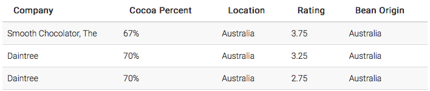
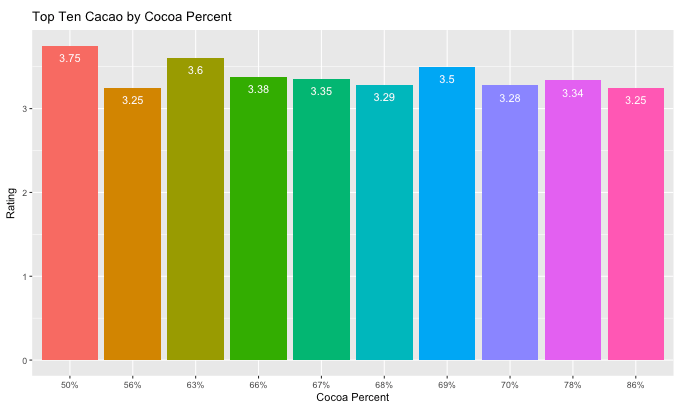

## Crazy Cacao Documentation

### General Information
**Crazy Cacao** is an interactive web application built using the [Shiny](https://shiny.rstudio.com/) framework for R, utilizing the `flavors_of_cacao` dataset from [Kaggle](https://www.kaggle.com/rtatman/chocolate-bar-ratings). This application serves as an easy way for fresh cocoa enthusiasts and chocolate lovers alike to find the ideal tasting cacao that best suits their preferences. The main application is broken down into two different subsets, which include the *Rated Companies* and *Cacao Visualizations* utilities.

#### Rated Companies
The **Rated Companies** utility displays a table of companies in descending order of cacao rating. The purpose of this utility is to provide information about the best cacao companies by filtering data based on preference inputs. The utility has 3 widgets:

* **Cocoa Percentage Range** - Defines the range of cocoa percent values to filter data by. By default, the slider is set to `60-80`.
* **Bean Origin Preference** - Defines the location of the user's preferred cacao bean origin. By default, the dropdown is set to `No Preference` which includes all bean origins.
* **Preferred Cacao Company Location** - Defines the preferred location of the cacao company. For example, a user who enjoys chocolate by Swiss companies might choose `Switzerland` from the dropdown. By default, the dropdown value is set to `Any`, which includes all company locations.

The table on the right hand side of the widgets will display results based on user-defined inputs. The dropdown above the table can be used to display more results on the page. The page buttons below the table can be used to navigate through multiple pages of results.

#### Cacao Visualizations
The **Cacao Visualizations** utility displays a bar graph containing the top ten rated values of a user-defined category based on the collective average ratings for that specific category. This utility only contains a single dropdown widget:

* **Category** - Defines the specific category to filter the average ratings by. Choices include `Company`, `Cocoa Percent`, `Location`, and `Broad Bean Origin` with `Cocoa Percent` being selected by default.

The container on the right-hand side of the widget will display a graph with the top ten rated values of the category that was selected. For example, `Cocoa Percent` is selected from the dropdown by default. The displayed graph will show the top ten most popular cocoa percentages based on their collective average ratings.

***
### Authors
[Crazy Cacao](https://github.com/sonalibaliga/Chocolate-Bar-Ratings) was created by and is currently being maintained by Team SPAM. The application was originally created as a final project submission for the [INFO201](https://ischool.uw.edu/) course at the [University of Washington](http://www.washington.edu/) during the Winter quarter of 2018. Team SPAM's members consist of:
* [Arman Shah](https://github.com/itsarman)
* [Peter Yee](https://github.com/peter-yee)
* [Sonali Baliga](https://github.com/sonalibaliga)
* [Melissa Do](https://github.com/melissado)
***
### Sources & Credit
All of the resources that we used to build this application have been cited below. Crazy Cacao is also open-sourced on [GitHub](https://github.com/sonalibaliga/Chocolate-Bar-Ratings).
#### R Dependencies
* [shiny](https://shiny.rstudio.com/)
* [markdown](https://rmarkdown.rstudio.com/)
* [ggplot2](http://ggplot2.org)
* [dplyr](https://www.r-project.org/nosvn/pandoc/dplyr.html)

#### Assets
* **Logo** - [FiveClipArt](https://www.fiveclipart.com)
* **Dataset** - [Kaggle](https://www.kaggle.com/rtatman/chocolate-bar-ratings)
* **Icons** - [Font Awesome](https://fontawesome.com/)
* **Header Image** - [pngtree](https://pngtree.com/free-png-vectors/chocolate-drops)
* **Cacao Facts** - [Fine Dining Lovers](https://www.finedininglovers.com/stories/cacao-facts/)
